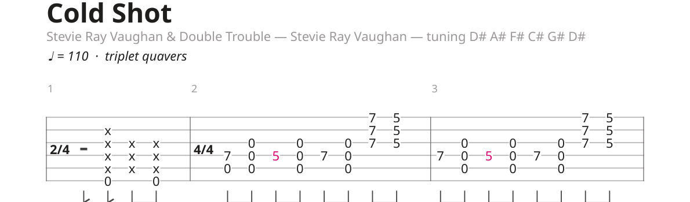
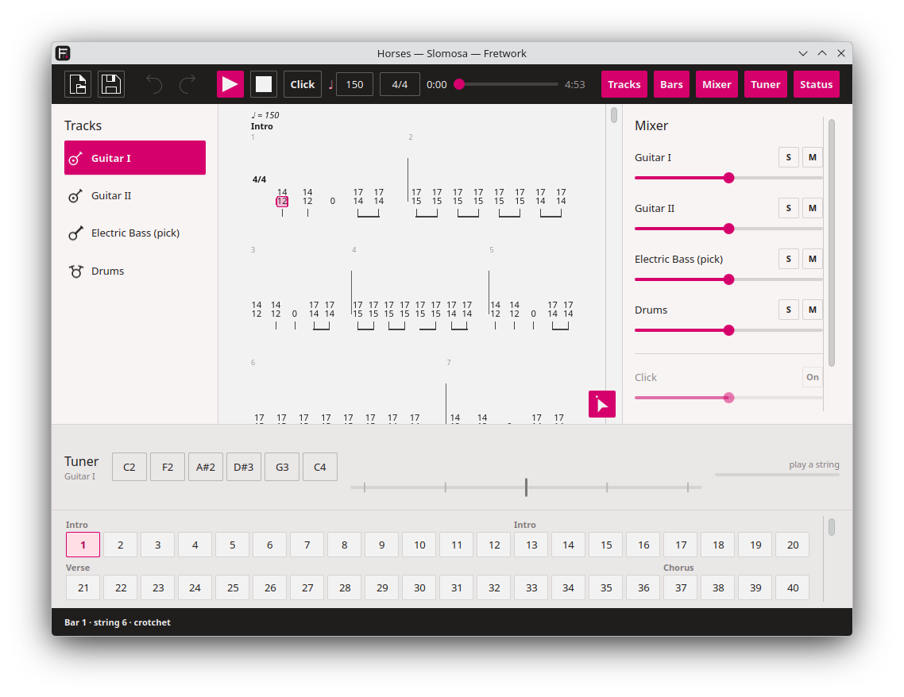

<!--
SPDX-FileCopyrightText: 2026 Gary Bissett <gary.bissett@gmail.com>

SPDX-License-Identifier: GPL-2.0-only OR GPL-3.0-only OR LicenseRef-KDE-Accepted-GPL
-->

<h1>
  <picture>
    <source media="(prefers-color-scheme: dark)" srcset="icons/128-apps-io.github.sonicp3l1c4n.fretwork.png">
    
  </picture>
  Fretwork
</h1>

**A tablature program for Linux that plays every track as its own stem.**

Reads Guitar Pro files, converts them to a format of its own, and renders each
track through a separate synthesised instrument — so a track can be soloed, sent
through its own amplifier simulation, and exported as an independent audio file.

That last part is the reason the project exists. Linux already has a tablature
editor: TuxGuitar has been at it for twenty years and is not going to be beaten
at being TuxGuitar. What no tablature program on Linux does is treat the score as
a multitrack session — one synth per track, per-track LV2 effects, real stems out
the other end. Fretwork is that program, and everything else it does is in
service of it.

## Status

**P2 — it is an application.** `fretwork FILE.gp` opens a window: the tablature
on the left, a mixer on the right, a transport across the top, and the bar being
played lit up as it goes.


Every track is a row down the left with a drawing of what it is — a guitar, a
bass, a drum kit — opposite the mixer, which says what it sounds like. Every
bar of the piece is a box along the bottom, with the section names in among the
numbers: click one and the caret and the playhead both go there, and while it
plays the strip follows the music.

Every track has a synthesiser of its own, so the **S** and **M** buttons take
effect while it plays — no re-render, no bounce. The view follows the playhead
until you scroll, and then leaves you where you looked. The bar strip, the
mixer and the status bar can each be put away from the toolbar, and stay put
away.

Where a score is beyond what it can honestly play, it says so rather than
playing it wrongly:


**P3 has begun: it edits.** Click a string, type a fret number, and the score
changes. Arrows move the caret, `Delete` clears a note, and every change is
undoable — typing `1` then `2` is fret 12 and one press of undo, not two.

`x` marks a dead note, `g` a ghost note, `p` palm mutes and `l` lets ring —
the note under the caret or the whole selection, and on unless it is on
already. Only those four, because they are the ones Fretwork can both draw and
play: palm muting and letting ring are printed the way tablature prints them,
as a label over the staff with a dashed line saying how far the hand keeps
doing it.

`+` and `-` transpose: the note under the caret, or everything in the
selection, along the strings it is already on — refused outright where any of
it would run off the neck, because a phrase with one note left behind is not
the phrase that was asked for. `Alt` with an arrow moves a note to the next
string and keeps its pitch, which is the one edit that changes a fret without
changing the music.

Rhythm is editable too: `Ctrl` and a digit sets how long a beat lasts — 1 a
semibreve, 2 a minim, and on down by halves — `.` dots it, and `Ctrl` with an
arrow doubles or halves it. `Insert` makes room for a beat and `Ctrl+Delete`
takes one out, and typing a number past the end of a bar writes the beat as
well as the note, which is how music reaches the end of a piece.

A bar that no longer adds up to its time signature is marked rather than
corrected: taking the difference out of the next note along would be rewriting
music nobody asked it to touch.

Shift with an arrow selects, and so does dragging across the score; `Ctrl+C`,
`Ctrl+X` and `Ctrl+V` do what they do everywhere else. A clip keeps the bars it
was copied from — four bars of a riff paste as four bars, because pasting them
as one long bar would be the same notes and not the same music — and a paste
that would run off the end of the score is refused outright rather than half
done.

The score can grow. `Ctrl+B` puts a bar on the end and the caret in it,
`Ctrl+Shift+B` makes room at the caret, and `Ctrl+Shift+Delete` takes a bar
out — in every track at once, because a master bar is the score's own unit of
time and one added to the guitar alone would put the bass out of step for the
rest of the piece. A new bar is worth what the one it displaced was, so a bar
added to a piece in 6/8 is in 6/8, and the tempo changes written after it move
along with the music. The last bar of a score is kept: a score with no bars is
not a shorter score.

**The tempo is editable**, which it had to become the moment there was a
metronome to hear it against. The field beside the transport reads what the
caret's bar is played at and writing in it sets the tempo from that bar on —
accented while the bar carries a change of its own, quiet while it is living
under one written earlier, because those two look identical and behave
differently when they are edited.

At the bar line and not at the caret: gpif can put a change part way through a
bar and Fretwork deliberately will not, because a caret on the third beat is
where somebody is typing notes rather than a statement about where the music
changes speed — and a change with no visible start is one nobody can find to
remove. Setting a tempo sweeps up any other change already in that bar, so a
bar has one tempo and one place to look for it. Something outside 20 to 400 is
refused rather than clamped, since quietly turning 1100 into 400 leaves
somebody hunting for the tempo they typed. The first bar keeps a tempo
whatever happens: with nothing before it to inherit from, taking its marking
off would mean playing at whatever the default happens to be, which is not
what anybody means by removing one.

**And so is the time signature**, in the field beside it. Writing `6/8` there
sets it from the caret's bar until the next change — not that one bar. gpif
keeps a signature on every master bar because that is how the file is shaped,
but somebody who writes 3/4 at bar five means bars five onwards, so it runs
forward over every bar sharing the old signature and stops at the first that
does not, which is where the next change already is. A denominator that is not
a power of two is refused: 4/5 is a slipped finger, not a bar anybody can
write down.

What is already in those bars stays exactly where it is. A bar of four
crotchets asked to be 3/4 is now a bar that does not add up, and the page marks
it — taking the difference out of the last note would be rewriting music nobody
asked it to touch, which is the one thing an editor must never do quietly.

The page carries it too, in the direction row above the section names, where
printed music has always put it:



That row is on every page now rather than only where a feel starts. Once the
tempo is printed there is no such thing as a score with nothing to say — every
piece has a speed, and a page that does not give it is missing the first thing
a player looks for.

**It saves.** `Ctrl+S` writes a `.fw` — a ZIP holding readable JSON, so a file
attached to a bug report can be understood by looking at it. Every score in the
test corpus survives import, save and reopen describing exactly the same music.

A `.fw` holds *Fretwork's* model, not everything a `.gp` contained: lyrics,
chord diagrams and Guitar Pro's own effects are read past on import and are not
there to write out. And Fretwork deliberately **cannot write `.gp`** — reading a
format nobody documented is one risk; handing people files to open in somebody
else's program is a different and worse one. An imported score stays as its
author wrote it.

It is still a command line tool when asked to be:

```
$ fretwork --info "Beautiful Losers.gp"
Beautiful Losers — Coheed And Cambria
  Guitar Pro 8.1.4, 86 bars notated, 86 played, 3:24
  tempo   76 bpm at bar 1
  [0] Claudio                electricGuitar   prog 29     1436 notes   tuning 38 45 50 55 59 64
  ...
```

**It plays**, through PipeWire, with a mixer:

```
fretwork FILE.gp --play                 # everything
fretwork FILE.gp --play --solo 1        # just that track
fretwork FILE.gp --play --mute 3        # everything but that one
fretwork FILE.gp --play --click         # with a metronome
```

```
$ fretwork "The Dogs Of War.gp" --play --solo 0
  playing 1:06 through pipewire — gilmour
  0:23 / 1:06
```

Soloing is what a synth per track buys: no re-render, no bounce, just that
track's own audio and nothing else.

**It counts.** `--click`, or the button beside the transport, puts a metronome
on every beat — the beat a musician counts rather than the one the denominator
names, so 6/8 is two beats of three quavers and not six of one, and 3/8 is
three, because that is how everybody who plays it counts it. The first beat of
every bar leans, including the first beat after a short pickup bar: a bar line
you cannot hear is no use to count by.

It is claves, at two levels — the same sound leaning about three decibels on
the first beat, because an accent is emphasis and not a different instrument.
The sound was chosen by measuring rather than by taste: against a rendered
mix, a wood block sat far enough under the music to vanish and only the
downbeat came through, which is a metronome that appears to be counting bars.

The click is not a fixture. It is a part — a list of messages and an instrument
to play them on — handed to the same synth as every track, which is why it has
a strip of its own at the foot of the mixer with a level and no solo button:
soloing the guitar to hear what it is doing is not a reason to lose the beat
you are hearing it against. Nothing in the engine had to learn a new idea to
have a metronome, which is the useful thing about it.

`--render --click` writes `click.wav` beside the stems and deliberately leaves
it out of the mix: stems exist to be put back together somewhere else, and a
click baked into a mix is one nobody can take out again.

**It listens**, which is new: the first thing in the program that wants a
guitar lead rather than a speaker.



A band across the bottom rather than a panel beside the score, because tuning
is a thing done to the instrument and not to the document: it wants to be wide,
read from across the room, and gone again when it is finished with. The input is
open only while the panel is, because nothing about reading a tab justifies
holding a microphone open behind a closed one — and it is the one panel that
starts closed, for the same reason.

It is on the command line too, and needs no window there either:

```
fretwork FILE.gp --tune                  # tune to that score's own tuning
fretwork --tune                          # no score: standard tuning
fretwork FILE.gp --tune --input NAME     # listen on a particular input
```

```
$ fretwork "Slomosa-Horses.gp" --tune
  Guitar I: C2 F2 A#2 D#3 G3 C4
  listening on the default input at 48000 Hz — Ctrl-C to stop

  string 2  F2   ............|.o..........   +8 ¢    sharp    87.7 Hz
```

The tuning comes out of the file, and that is the whole difference between this
and every other tuner: a chromatic tuner hears an F and says so, leaving the
player to know whether an F is what this piece wants of that string. A capo is
in the target, because the target is what the string will sound when it is
plucked. Where what was played is too far from any string to be one of them it
names the note and leaves the choice alone, rather than guessing between two
pegs.

The pitch is found with YIN rather than a Fourier transform: a plucked low
string's second harmonic is routinely louder than its fundamental, and a
spectrum peak-picker reports the octave above and is confidently wrong. One
note at a time, and a strummed chord gets "hearing something, but no note in
it", which is true.

**It draws the tablature**:

```
fretwork FILE.gp --pdf out.pdf       # every page
fretwork FILE.gp --png page.png --page 2 --track 1
```

Title, tuning, section names, bar numbers, time signatures, repeat signs, dead
notes and ghost notes, palm-muted and let-ring runs labelled over the staff
with a dashed line for as long as they last, and fret numbers coloured where a
technique is marked on them. Under the
strings, a row of stems saying how long each column lasts — beamed in the groups
the time signature makes, flagged where there is nothing to beam to, with an
open head for a minim and a mark in the staff where nothing sounds. Bar widths
follow the square root of duration rather than duration itself, which is what
engravers have used for centuries and the reason a bar of semiquavers is
readable; lines are justified to the page except the last, which is left alone.

**It renders audio**, which is what the project is for:

```
fretwork FILE.gp --render out/       # one WAV per track, and a mix
fretwork FILE.gp -m out.mid          # a MIDI file
fretwork FILE.gp --stems out/        # one MIDI file per track, plus a mix
```

```
$ fretwork "The Dogs Of War.gp" --render out/
  00-gilmour.wav                 1:06  peak 0.25
  01-wright.wav                  1:06  peak 0.36
  02-pratt.wav                   1:06  peak 0.14
  03-mason.wav                   1:06  peak 0.18
  mix.wav                        1:06  peak 0.46
```

Each track gets a FluidSynth of its own — sixteen channels each, so a guitar
spends six on its strings and nothing collides. The mix is the sum of the
stems, and they are written in one pass at about twenty times real time.

All eleven files in the corpus read, with note counts agreeing exactly with the
P0 spike, and bends, let ring and hammer-ons that the spike never attempted.
Sixteen MIDI channels cannot hold a channel per string for four guitars at
once, so the *MIDI* writer says what it gave up:

```
  note: pratt shares one MIDI channel across 4 strings, so a bend moves
        every note it is holding
```

Audio rendering has no such limit, because nothing is shared: that compromise
is a property of the MIDI file format, not of the program.

**It shuffles.** Guitar Pro records a triplet feel per bar, and a score that
has one is not a score with a missing ornament — played evenly, a shuffle is
the wrong music, and the kind of wrong that sounds like a decision. Fretwork
plays the pair of quavers as two thirds and one third of a crotchet, which is
what everybody means by a shuffle, along with the dotted and snapped feels
Guitar Pro also writes.

It is done as a warp of the bar's own time rather than as a rule about which
notes count as a swung pair, which is the version that goes wrong. The warp is
the identity at every pair boundary, so a crotchet on the beat does not move; a
triplet written inside a swung bar — which happens, and is not a contradiction
— is carried along with everything else instead of being argued about; and a
7/8 bar, which holds three pairs and a quaver over, keeps that odd quaver where
it was written and stays exactly as long as it was. A feel that changed how
long a bar lasted would have quietly rewritten every bar after it.

The page prints it, in the direction row above the section names where printed
music has always put what it says to the player rather than what it draws for
them to play — italic, over the bar the feel starts on, and again where it
stops, because a shuffle that merely stopped being printed would read as one
that carries on. It shares that row with the tempo marking, which is the other
thing said rather than drawn.

`--info` prints it too:

```
  feel    triplet quavers throughout
```

Not yet translated: slides, tremolo picking, harmonics, grace notes and trills
sound as plain notes; alternate endings are not flattened, and a score using
them says so.

The P0 spike is still in `spike/`, and still the shortest way to hear one:

```
$ python3 spike/gp2midi.py "Slomosa-Horses.gp"
Horses — Slomosa
  Guitar Pro 8.1.3, 176 bars notated, 176 played
  tempo   150 bpm at bar 1, 145 bpm at bar 103, 100 bpm at bar 170
  [0] Guitar I               electricGuitar   prog 29   1429 notes   tuning 36 41 46 51 55 60
  [1] Guitar II              electricGuitar   prog 29   1476 notes   tuning 36 41 46 51 55 60
  [2] Electric Bass (pick)   electricBass     prog 34    872 notes   tuning 24 29 34 39
  [3] Drums                  drumKit          prog 0    1292 notes   tuning 0 0 0 0 0 0
```

— and `--stems DIR` writes one WAV per track plus a mix. Eleven Guitar Pro 8
files parse, play at the right tempo for the right length, and come out as
separate stems.

## Documents

- **[docs/architecture.md](docs/architecture.md)** — what gets built, in what
  order, on what stack, and why each choice beat the alternative. Read this
  first.
- **[docs/gpif-format.md](docs/gpif-format.md)** — how a `.gp` file is actually
  put together, measured against a real corpus rather than assumed. There is no
  vendor specification for any of this.
- **[docs/wishlist.md](docs/wishlist.md)** — everything that has been thought of
  and not promised, with the price of each next to it, and the things that are
  refused on principle at the bottom.

## The stack, briefly

C++20 with Qt 6 and KDE Frameworks 6 for the application; Rust behind a C ABI
for the file importers, because that is the only code eating untrusted binary
input; FluidSynth for synthesis, one instance per track; lilv and suil for
per-track LV2 chains; PipeWire out. CMake and Ninja, KDE's own conventions,
GPL — the reasoning for every line of that is in
[docs/architecture.md](docs/architecture.md).

## The plan

| | | |
|---|---|---|
| **P0** | Spike — parse, play, render stems | **done**, and it plays |
| **P1** | Headless converter: importers, model, technique translation, stem export. No window | **done** — the program is useful with no window |
| **P2** | The player: tab rendering, transport, mixer, live playback | **done** |
| **P3** | The editor: fret entry, undo, copy and paste | **in progress** — caret, fret entry, beats, bars, durations, selection, copy and paste, undo and saving |
| P4 | Per-track LV2 chains, guitarix, SFZ sampling with round-robins | |
| P5 | Standard notation, PDF, MusicXML, GP6 | |

P1 is the one that matters: at the end of it the program is useful with no user
interface at all, which is the only honest definition of a foundation.

## Building

```
sudo apt install build-essential cmake ninja-build extra-cmake-modules \
    qt6-base-dev libkf6archive-dev libkf6coreaddons-dev libkf6i18n-dev \
    zlib1g-dev libfluidsynth-dev fluid-soundfont-gm

cmake -B build -G Ninja
cmake --build build
ctest --test-dir build --output-on-failure
./build/bin/fretwork FILE.gp
```

The test suite runs without any Guitar Pro files: every structural case is built
in code. Point `FRETWORK_CORPUS` at a directory of `.gp` files to check real
ones too — transcriptions are not ours to commit.

## Running the spike

Needs `python3` and, for anything audible, `fluidsynth` with a SoundFont:

```
sudo apt install fluidsynth fluid-soundfont-gm

python3 spike/gp2midi.py FILE.gp                 # write a MIDI file
python3 spike/gp2midi.py FILE.gp --play          # play it now
python3 spike/gp2midi.py FILE.gp --stems out/    # one WAV per track, plus a mix
python3 spike/gp2midi.py FILE.gp --no-repeats    # as notated, not as played
```

No dependencies beyond the standard library, on purpose: a spike that needs a
virtualenv is a spike nobody runs twice.

## The look

Ink chrome, paper in the middle, and one magenta taken from the fret marker on
the app icon. The colours are the application's own rather than the desktop's,
which is the choice a PDF reader makes and for the same reason: the thing in
the middle is a document, and a document that changed colour with the desktop
theme would be a different document. The chrome is dark so that the paper is
the brightest thing in the window.

They live in exactly two places — `src/gui/Ink.qml` for the window and
`Tab::Palette` in `src/render/tabpainter.h` for the page — because C++ paints
the score and QML paints everything round it, and neither can read the other's
constants. The page is printed on white rather than on the window's off-white,
which is the one colour a sheet of paper wants left alone.

## The icon

An F built from a nut and strings, with a fret marker on it — drawn for this
project, and ours like the rest of the artwork. Six raster sizes, a scalable
copy, and a symbolic version, in `icons/`.

The instrument drawings in the track list are ours too, in the same idiom and
in the same directory: no icon theme ships a guitar, a bass or a drum kit, and
a list that told them apart by their labels alone would be a list of words.

## Names and law

"Guitar Pro" is a trademark of Arobas Music. Fretwork is not affiliated with
them, not derived from their software, and ships none of their soundbanks or
artwork. It reads a file format — which reverse engineering for
interoperability expressly permits (EU Software Directive 2009/24/EC, Article
6), and which is not the same thing as copying a program.

The test corpus is transcriptions the author owns. It is not redistributed and
not committed.

## Licence

GPL-2.0-only OR GPL-3.0-only OR LicenseRef-KDE-Accepted-GPL, which is KDE's
preferred expression for application code. REUSE-compliant; every file says so
itself.
