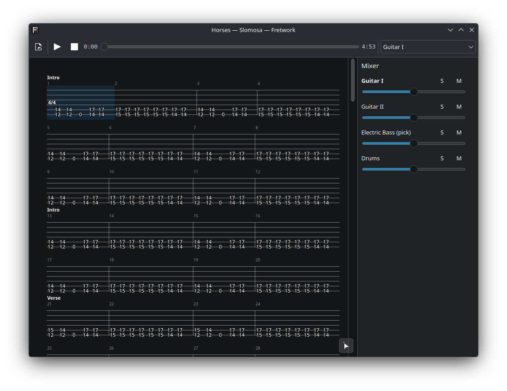
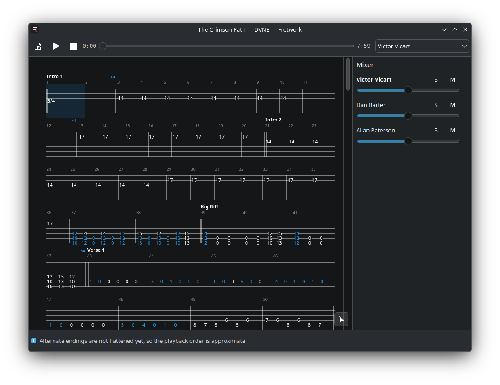

<!--
SPDX-FileCopyrightText: 2026 Gary Bissett <gary.bissett@gmail.com>

SPDX-License-Identifier: GPL-2.0-only OR GPL-3.0-only OR LicenseRef-KDE-Accepted-GPL
-->

<h1>
  <picture>
    <source media="(prefers-color-scheme: dark)" srcset="icons/64-apps-io.github.sonicp3l1c4n.fretwork.png">
    
  </picture>
  Fretwork
</h1>

**A tablature program for Linux that plays every track as its own stem.**

Reads Guitar Pro files, converts them to a format of its own, and renders each
track through a separate synthesised instrument — so a track can be soloed, sent
through its own amplifier simulation, and exported as an independent audio file.

That last part is the reason the project exists. Linux already has a tablature
editor: TuxGuitar has been at it for twenty years and is not going to be beaten
at being TuxGuitar. What no tablature program on Linux does is treat the score as
a multitrack session — one synth per track, per-track LV2 effects, real stems out
the other end. Fretwork is that program, and everything else it does is in
service of it.

## Status

**P2 — it is an application.** `fretwork FILE.gp` opens a window: the tablature
on the left, a mixer on the right, a transport across the top, and the bar being
played lit up as it goes.



Every track has a synthesiser of its own, so the **S** and **M** buttons take
effect while it plays — no re-render, no bounce. The view follows the playhead
until you scroll, and then leaves you where you looked.

Where a score is beyond what it can honestly play, it says so rather than
playing it wrongly:



It is still a command line tool when asked to be:

```
$ fretwork --info "Beautiful Losers.gp"
Beautiful Losers — Coheed And Cambria
  Guitar Pro 8.1.4, 86 bars notated, 86 played, 3:24
  tempo   76 bpm at bar 1
  [0] Claudio                electricGuitar   prog 29     1436 notes   tuning 38 45 50 55 59 64
  ...
```

**It plays**, through PipeWire, with a mixer:

```
fretwork FILE.gp --play                 # everything
fretwork FILE.gp --play --solo 1        # just that track
fretwork FILE.gp --play --mute 3        # everything but that one
```

```
$ fretwork "The Dogs Of War.gp" --play --solo 0
  playing 1:06 through pipewire — gilmour
  0:23 / 1:06
```

Soloing is what a synth per track buys: no re-render, no bounce, just that
track's own audio and nothing else.

**It draws the tablature**:

```
fretwork FILE.gp --pdf out.pdf       # every page
fretwork FILE.gp --png page.png --page 2 --track 1
```

Title, tuning, section names, bar numbers, time signatures, repeat signs, dead
notes, and fret numbers coloured where a technique is marked on them. Bar widths
follow the square root of duration rather than duration itself, which is what
engravers have used for centuries and the reason a bar of semiquavers is
readable; lines are justified to the page except the last, which is left alone.

**It renders audio**, which is what the project is for:

```
fretwork FILE.gp --render out/       # one WAV per track, and a mix
fretwork FILE.gp -m out.mid          # a MIDI file
fretwork FILE.gp --stems out/        # one MIDI file per track, plus a mix
```

```
$ fretwork "The Dogs Of War.gp" --render out/
  00-gilmour.wav                 1:06  peak 0.25
  01-wright.wav                  1:06  peak 0.36
  02-pratt.wav                   1:06  peak 0.14
  03-mason.wav                   1:06  peak 0.18
  mix.wav                        1:06  peak 0.46
```

Each track gets a FluidSynth of its own — sixteen channels each, so a guitar
spends six on its strings and nothing collides. The mix is the sum of the
stems, and they are written in one pass at about twenty times real time.

All eleven files in the corpus read, with note counts agreeing exactly with the
P0 spike, and bends, let ring and hammer-ons that the spike never attempted.
Sixteen MIDI channels cannot hold a channel per string for four guitars at
once, so the *MIDI* writer says what it gave up:

```
  note: pratt shares one MIDI channel across 4 strings, so a bend moves
        every note it is holding
```

Audio rendering has no such limit, because nothing is shared: that compromise
is a property of the MIDI file format, not of the program.

Not yet translated: slides, tremolo picking, harmonics, grace notes and trills
sound as plain notes; alternate endings are not flattened, and a score using
them says so.

The P0 spike is still in `spike/`, and still the shortest way to hear one:

```
$ python3 spike/gp2midi.py "Slomosa-Horses.gp"
Horses — Slomosa
  Guitar Pro 8.1.3, 176 bars notated, 176 played
  tempo   150 bpm at bar 1, 145 bpm at bar 103, 100 bpm at bar 170
  [0] Guitar I               electricGuitar   prog 29   1429 notes   tuning 36 41 46 51 55 60
  [1] Guitar II              electricGuitar   prog 29   1476 notes   tuning 36 41 46 51 55 60
  [2] Electric Bass (pick)   electricBass     prog 34    872 notes   tuning 24 29 34 39
  [3] Drums                  drumKit          prog 0    1292 notes   tuning 0 0 0 0 0 0
```

— and `--stems DIR` writes one WAV per track plus a mix. Eleven Guitar Pro 8
files parse, play at the right tempo for the right length, and come out as
separate stems.

## Documents

- **[docs/architecture.md](docs/architecture.md)** — what gets built, in what
  order, on what stack, and why each choice beat the alternative. Read this
  first.
- **[docs/gpif-format.md](docs/gpif-format.md)** — how a `.gp` file is actually
  put together, measured against a real corpus rather than assumed. There is no
  vendor specification for any of this.

## The stack, briefly

C++20 with Qt 6 and KDE Frameworks 6 for the application; Rust behind a C ABI
for the file importers, because that is the only code eating untrusted binary
input; FluidSynth for synthesis, one instance per track; lilv and suil for
per-track LV2 chains; PipeWire out. CMake and Ninja, KDE's own conventions,
GPL — the reasoning for every line of that is in
[docs/architecture.md](docs/architecture.md).

## The plan

| | | |
|---|---|---|
| **P0** | Spike — parse, play, render stems | **done**, and it plays |
| **P1** | Headless converter: importers, model, technique translation, stem export. No window | **done** — the program is useful with no window |
| **P2** | The player: tab rendering, transport, mixer, live playback | **done** |
| P3 | The editor: fret entry, undo, copy and paste | |
| P4 | Per-track LV2 chains, guitarix, SFZ sampling with round-robins | |
| P5 | Standard notation, PDF, MusicXML, GP6 | |

P1 is the one that matters: at the end of it the program is useful with no user
interface at all, which is the only honest definition of a foundation.

## Building

```
sudo apt install build-essential cmake ninja-build extra-cmake-modules \
    qt6-base-dev libkf6archive-dev libkf6coreaddons-dev libkf6i18n-dev \
    zlib1g-dev libfluidsynth-dev fluid-soundfont-gm

cmake -B build -G Ninja
cmake --build build
ctest --test-dir build --output-on-failure
./build/bin/fretwork FILE.gp
```

The test suite runs without any Guitar Pro files: every structural case is built
in code. Point `FRETWORK_CORPUS` at a directory of `.gp` files to check real
ones too — transcriptions are not ours to commit.

## Running the spike

Needs `python3` and, for anything audible, `fluidsynth` with a SoundFont:

```
sudo apt install fluidsynth fluid-soundfont-gm

python3 spike/gp2midi.py FILE.gp                 # write a MIDI file
python3 spike/gp2midi.py FILE.gp --play          # play it now
python3 spike/gp2midi.py FILE.gp --stems out/    # one WAV per track, plus a mix
python3 spike/gp2midi.py FILE.gp --no-repeats    # as notated, not as played
```

No dependencies beyond the standard library, on purpose: a spike that needs a
virtualenv is a spike nobody runs twice.

## The icon

An F built from a nut and strings, with a fret marker on it — drawn for this
project, and ours like the rest of the artwork. Six raster sizes, a scalable
copy, and a symbolic version, in `icons/`.

## Names and law

"Guitar Pro" is a trademark of Arobas Music. Fretwork is not affiliated with
them, not derived from their software, and ships none of their soundbanks or
artwork. It reads a file format — which reverse engineering for
interoperability expressly permits (EU Software Directive 2009/24/EC, Article
6), and which is not the same thing as copying a program.

The test corpus is transcriptions the author owns. It is not redistributed and
not committed.

## Licence

GPL-2.0-only OR GPL-3.0-only OR LicenseRef-KDE-Accepted-GPL, which is KDE's
preferred expression for application code. REUSE-compliant; every file says so
itself.
