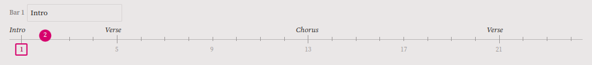
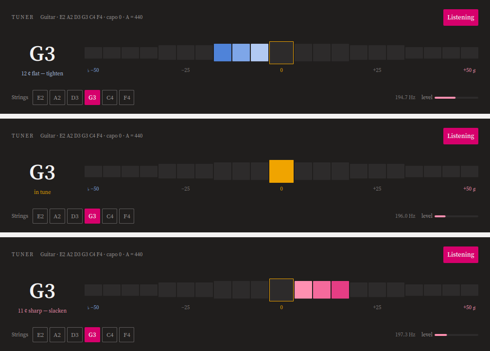

<!--
SPDX-FileCopyrightText: 2026 Gary Bissett <gary.bissett@gmail.com>

SPDX-License-Identifier: GPL-2.0-only OR GPL-3.0-only OR LicenseRef-KDE-Accepted-GPL
-->

<h1>
  <picture>
    <source media="(prefers-color-scheme: dark)" srcset="icons/128-apps-io.github.sonicp3l1c4n.fretwork.png">
    
  </picture>
  Fretwork
</h1>

**A tablature program for Linux that plays every track as its own stem.**

Reads Guitar Pro files, converts them to a format of its own, and renders each
track through a separate synthesised instrument — so a track can be soloed, sent
through its own amplifier simulation, and exported as an independent audio file.

That last part is the reason the project exists. Linux already has a tablature
editor: TuxGuitar has been at it for twenty years and is not going to be beaten
at being TuxGuitar. What no tablature program on Linux does is treat the score
as a multitrack session — one synth per track, per-track LV2 effects, real stems
out the other end. Fretwork is that program, and everything else it does is in
service of it.


## What it does

**Reads and plays.** GP7 and GP8 `.gp` files, through PipeWire, with a synth
per track so that solo and mute take effect while it plays — no re-render, no
bounce. Repeats are expanded; where a score is beyond what it can honestly
play, it says so rather than playing it wrongly.


**Edits.** Click a string and type a fret. Marks (`x` dead, `g` ghost, `p` palm
mute, `l` let ring), transposition, note durations, bars, parts, tuning, capo,
tempo, time signature and section names are all editable, everything is
undoable, and copy and paste keep the bars they came from. A bar that no longer
adds up is marked rather than corrected — taking the difference out of the next
note along would be rewriting music nobody asked it to touch.

**Is a document.** The score is real A4 pages, broken where the printed PDF
breaks them, stacked on a desk with a zoom in the status bar. What is on screen
and what comes out of `--pdf` are the same document.



**Knows what key a piece is in** — from the notes rather than from the page,
since a key signature is something a transcriber has to go out of their way to
set and almost nobody does. The **Scale** button draws that key on a fretboard
over the score, roots marked, with the frets under your hand lit. The **Chords**
button is a circle of fifths: turn it to a key, and its chords can be written
into the score at the caret as real notes on real strings.

**Tunes.** A chromatic tuner that knows the score's own tuning and capo, so it
listens for the strings the piece is actually written for.




**Saves.** `Ctrl+S` writes a `.fw` — a ZIP holding readable JSON, so a file
attached to a bug report can be understood by looking at it. Every score in the
test corpus survives import, save and reopen describing exactly the same music.
Fretwork deliberately **cannot write `.gp`**: reading a format nobody documented
is one risk, and handing people files to open in somebody else's program is a
different and worse one.

**Prints.** The page carries what printed music has always carried — the title,
the tuning, the tempo and the feel above the first bar:


**Is still a command line tool when asked to be.**

```
fretwork FILE.gp --info                  # what is in it
fretwork FILE.gp --play --solo 1         # play one track
fretwork FILE.gp --stems out/            # one WAV per track, plus a mix
fretwork FILE.gp --pdf score.pdf         # or --png with --page
fretwork FILE.gp --musicxml score.xml    # open it in something else
fretwork FILE.gp --save score.fw         # convert
fretwork FILE.gp --tune                  # tune to this score
```

## Status

**0.4.0 is released.** Per-track LV2 chains and SFZ sampling are present and
experimental, which is meant as it is written — they are the reason the program
exists and the least settled thing in it.

[CHANGELOG.md](CHANGELOG.md) is the honest account of what each release does and
why, including the things that were got wrong and fixed.

| | | |
|---|---|---|
| **P0** | Spike — parse, play, render stems | **done** |
| **P1** | Headless converter: importers, model, technique translation, stem export. No window | **done** — the program is useful with no window |
| **P2** | The player: tab rendering, transport, mixer, live playback | **done** |
| **P3** | The editor | **done** |
| **P4** | Per-track LV2 chains, guitarix, SFZ sampling with round-robins | **begun** — a chain per part, reorderable, saved under a name and reusable |
| ~~P5~~ | Standard notation, MusicXML, GP6 | retired — folded into **P8.2** to **P8.5** in [docs/roadmap.md](docs/roadmap.md); MusicXML and PDF are done |
| **P6** | Harmony: the fretboard solver, key spelling, analysis, the scale overlay, chords | **done** |
| **P7** | MIDI in: a control surface, notes typed from a keyboard, and notes recorded from one against the transport | **done** |
| P8 | fee[dB]ack practice packs | **begun** — packs are written; the techniques they cannot yet carry are named in [docs/roadmap.md](docs/roadmap.md) |

P1 is the one that matters: at the end of it the program is useful with no user
interface at all, which is the only honest definition of a foundation.

## Documents

- **[docs/architecture.md](docs/architecture.md)** — what gets built, in what
  order, on what stack, and why each choice beat the alternative. Read this
  first.
- **[docs/roadmap.md](docs/roadmap.md)** — the three directions past P4, with
  their dependencies and their prices, and a record of what each one actually
  cost when it was built.
- **[docs/road-to-1.0.md](docs/road-to-1.0.md)** — what the first number
  before the decimal point means, the six expansions weighed against what is
  already in the tree, and the three things refused to keep them affordable.
- **[docs/gpif-format.md](docs/gpif-format.md)** — how a `.gp` file is actually
  put together, measured against a real corpus rather than assumed. There is no
  vendor specification for any of this.
- **[docs/wishlist.md](docs/wishlist.md)** — everything thought of and not
  promised, with the price of each, and the things refused on principle.
- **[docs/distribution.md](docs/distribution.md)** — where the program is to
  be had, ranked by what each channel buys against what it costs, and the
  order they are done in.
- **[docs/release-0.1.0.md](docs/release-0.1.0.md)**,
  **[docs/rc-assessment.md](docs/rc-assessment.md)** and
  **[docs/wiring-notes.md](docs/wiring-notes.md)** — how the first release was
  decided on, what a pass over the tree found, and what was wired in to get
  there. Kept as written rather than tidied: the reasoning is the useful part.
- **[docs/lv2-worker-crash.md](docs/lv2-worker-crash.md)** — one bug, chased to
  the bottom, because what it was evidence of outlived the fix.

## The stack, briefly

C++20 with Qt 6 and KDE Frameworks 6; FluidSynth for synthesis, one instance per
track; lilv for per-track LV2 chains; PipeWire out. CMake and Ninja, KDE's own
conventions, GPL — the reasoning is in [docs/architecture.md](docs/architecture.md).

The importers are C++, because GP7 and GP8 are a ZIP and some XML rather than
hand-rolled binary. **Rust behind a C ABI is the plan for GP3–GP5 and GPX** —
the only code here that would read untrusted bytes by hand, and where `cargo
fuzz` finds what review does not. A plan rather than a line of the stack,
because none of it exists yet.

## Building

```
sudo apt install build-essential cmake ninja-build pkg-config gettext \
    extra-cmake-modules qt6-base-dev qt6-declarative-dev \
    libkf6archive-dev libkf6coreaddons-dev libkf6i18n-dev \
    libkirigami-dev \
    zlib1g-dev libfluidsynth-dev fluid-soundfont-gm

# Optional. Without lilv there are no per-track LV2 chains; without
# PipeWire's headers there is no transport; without cargo, a file from an
# older Guitar Pro is refused without being named.
sudo apt install liblilv-dev libpipewire-0.3-dev cargo

cmake -B build -G Ninja
cmake --build build
ctest --test-dir build --output-on-failure
./build/bin/fretwork FILE.gp
```

The suite runs without any Guitar Pro files: every structural case is built in
code. Point `FRETWORK_CORPUS` at a directory of `.gp` files to check real ones
too — transcriptions are not ours to commit.

>>>

## The look

Ink chrome, paper in the middle, and one magenta taken from the fret marker on
the app icon. The colours are the application's own rather than the desktop's,
which is the choice a PDF reader makes and for the same reason: the thing in the
middle is a document, and a document that changed colour with the desktop theme
would be a different document.

They live in exactly two places — `src/gui/Ink.qml` for the window and
`Tab::Palette` in `src/render/tabpainter.h` for the page — because C++ paints the
score and QML paints everything round it, and neither can read the other's
constants.

The icon is an F built from a nut and strings with a fret marker on it, drawn for
this project. The instrument drawings in the parts list are ours too: no icon
theme ships a guitar, a bass and a drum kit, and a list that told them apart by
their labels alone would be a list of words.

## Names and law

"Guitar Pro" is a trademark of Arobas Music. Fretwork is not affiliated with
them, not derived from their software, and ships none of their soundbanks or
artwork. It reads a file format — which reverse engineering for interoperability
expressly permits (EU Software Directive 2009/24/EC, Article 6), and which is
not the same thing as copying a program.

The test corpus is transcriptions the author owns. It is not redistributed and
not committed.

## Licence

GPL-2.0-only OR GPL-3.0-only OR LicenseRef-KDE-Accepted-GPL, which is KDE's
preferred expression for application code. REUSE-compliant; every file says so
itself.
